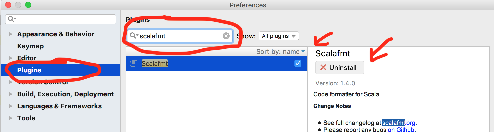

# Busylabs

## Mentors

| Name              | Email                               |    phone      | githubId      | skypeId                        |
|-------------------|-------------------------------------|---------------|---------------|--------------------------------|
| Mihai Simu        | mihai.simu@busymachines.com         | 0722558444    | mihaiSimu     | simu.mihai.stelian@gmail.com   |
| Lorand Szakacs    | lorand.szakacs@busymachines.com     | _             | lorandszakacs |  _                             |
| Alexandru Stana   | alexandru.stana@busymachines.com    | _             | alexandrustana|  _                             |
| Dan Vidican       | dan.vidican@busymachines.com        | _             | danvidican    |  _                             |
| Ioan Georgiu (Ion)| ioan.georgiu@busymachines.com       | _             | manufacturist |  _    
| Andra Cimpian-Ille| andra.cimpian-ille@busymachines.com | -             | AndraCimpian  |  -                             |

## Tooling

See [./lab_01/README.md](./lab_01/README.md) for a rundown of minimal tooling. This section here contains some cool extra stuff.

### IntelliJ

Got problems importing your project? Head over to the [`Importing an SBT project into IntelliJ`](./importing-a-project.md)

### scalafmt

It is *the* way to format your code. By defining a file [`.scalafmt.conf`](./.scalafmt.conf) in the root of your project you can start using it via the sbt-plugin (check the [project/plugins.sbt](./project/plugins.sbt) file), or via the IntelliJ plugin. Follow the screenshots bellow to install the latter.

Go to `File -> Preferences`:

Once you restart IntelliJ, `scalafmt` is available in the "Code" menu:

By default it doesn't have a hotkey, assign one from the keymap menu. I also removed the IntelliJ formatter hotkey, and assigned it to `scalafmt`:

### scalafix

Scalafix is a much needed tool to automate code transformations. If you look into the [.scalafix.conf](./.scalafix.conf) you will see that currently the only enabled rule is `RemoveUnusedImports` (IntelliJ's kinda fails from time to time). Run `scalafix` from the SBT console ocassionaly.