# Importing an SBT project into IntelliJ

`SBT is the single source of truth for your scala projects. End of story. If you can't do it from SBT, it's wrong.`

Starting from the above maxim, we need an IDE to just dumbly interpret the already painstakingly defined SBT build, and just work. IntelliJ is — unfortunately — one of the *better* options out there. But it has some seriously annoying quirks that can totally block your workflow. So here's a step-by-step guide on how to deal with IntelliJ.

Refer to the guide from [lab_01](./lab_01/README.md) if needed.

### 0 — Make sure you run everything from SBT

The first time you run `SBT` it will try to download itself, and then it will try to download, and compile itself a version of Scala compiler as defined yin the `build.sbt`. These two steps are something that IntelliJ does not trigger well. Therefore we must do it
in the console *before* we try anything in IntelliJ.

Run `;clean;update;compile` (yes, the `;` is first). It's ok if your project has warnings. But if it has errors (unless they're due to badly written code), there's no way it's going to work in IntelliJ.

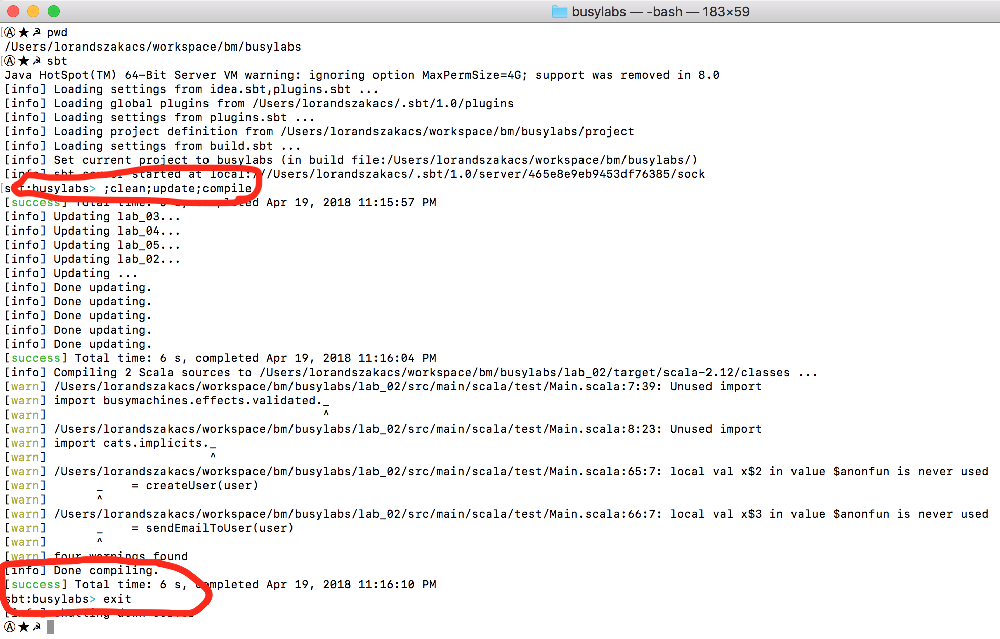

### 1 — Make sure you have Java 8 JDK installed, and that you know the path to the folder

You can access this menu in two ways:
1) Go to the menu `File -> Project Structure`, if you already have done step #2 by accident (or previously)

2) From the IntelliJ welcome screen, bottom right corner there's a `Configure` menu.

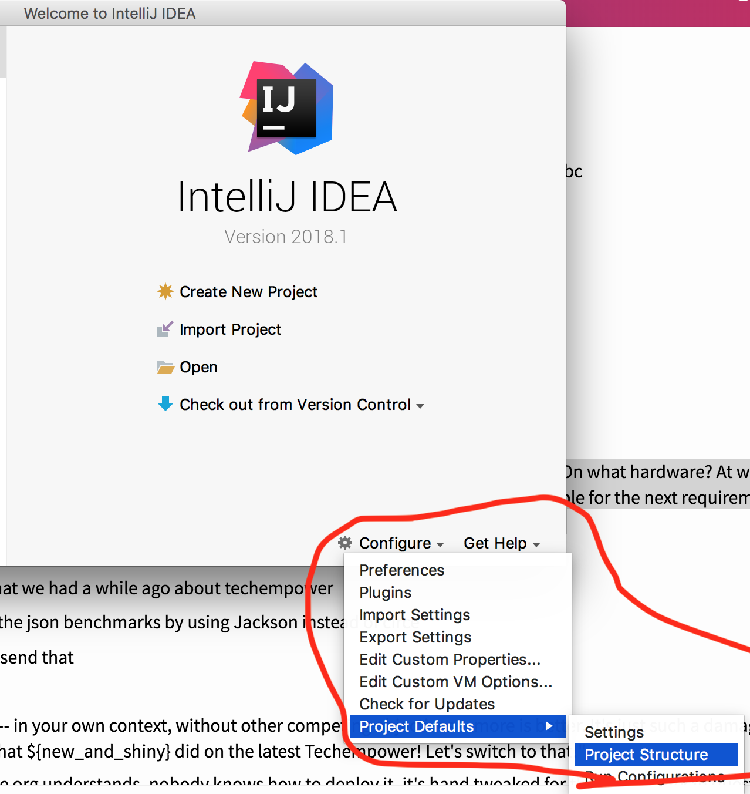

Regardless of how you got to the screen, from there do the following:

Click on the `+` to add a new SDK:
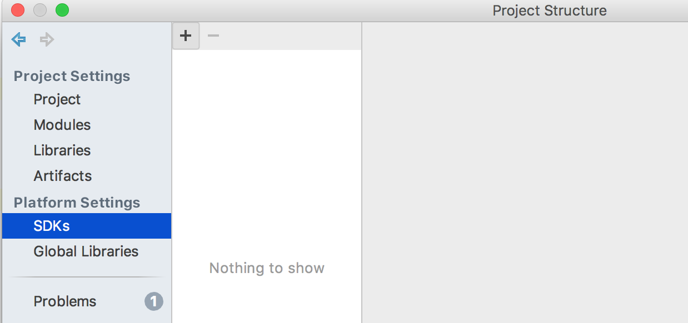

Most of the time IntelliJ should already be aware of it, so it should pop-up automatically. If not, bavigate to the root folder (the one containing the folder `bin`) of the Java 8 installation. Then select it.

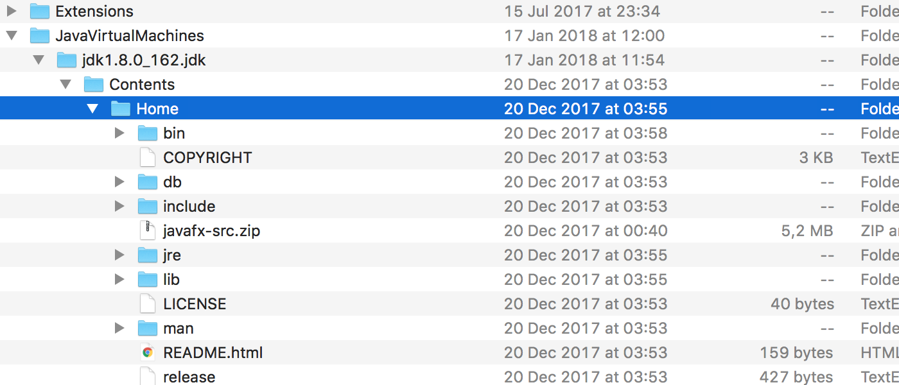

When done, you should be seeing something like. Then just hit "OK", and you should be ok.
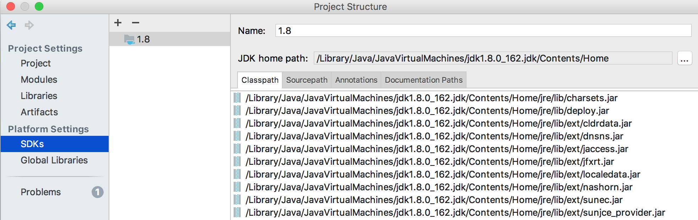

### 2 — Create an empty project

Not a `Scala` project, an `Empty` one!!

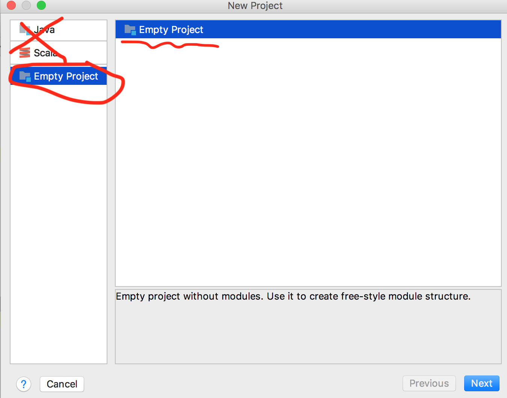

### 3 — Select destination folder — NOT the root of the git repo

On the next page choose the name of the *IntelliJ* project (the `sbt` project already has a name), this doesn't matter that much, but what does matter is that you `CHOOSE A FOLDER DIFFERENT THAN THE ROOT OF THE GIT REPO`. This is because the IntelliJ project is almost worthless, and can, and will be re-created several times by following these steps along the lifetime of the project. So it is convenient to just delete that folder. What matters is the source code and the `build.sbt`, not the IntelliJ files.

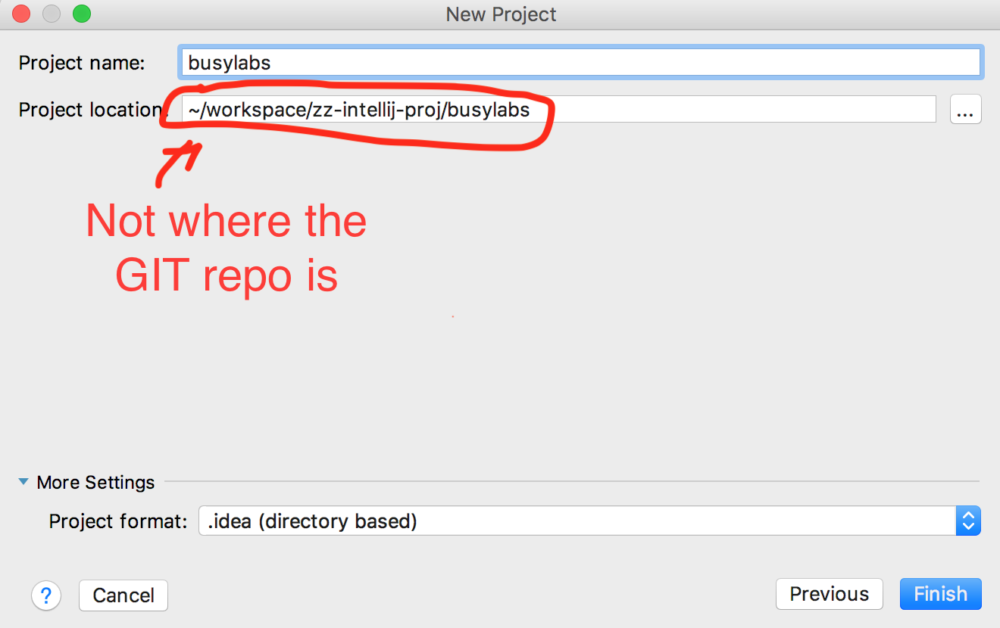

Click `Finish`.

### 4 — Set Project Structure

You get back to the familiar 'Project Structure' dialog which ought to look like:

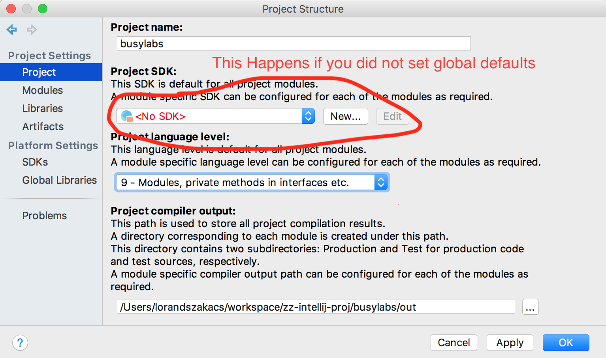

Don't worry, everything's easily fixed. Set the values like so, and then make sure you click that `Apply` button, we're not done in this menu yet.

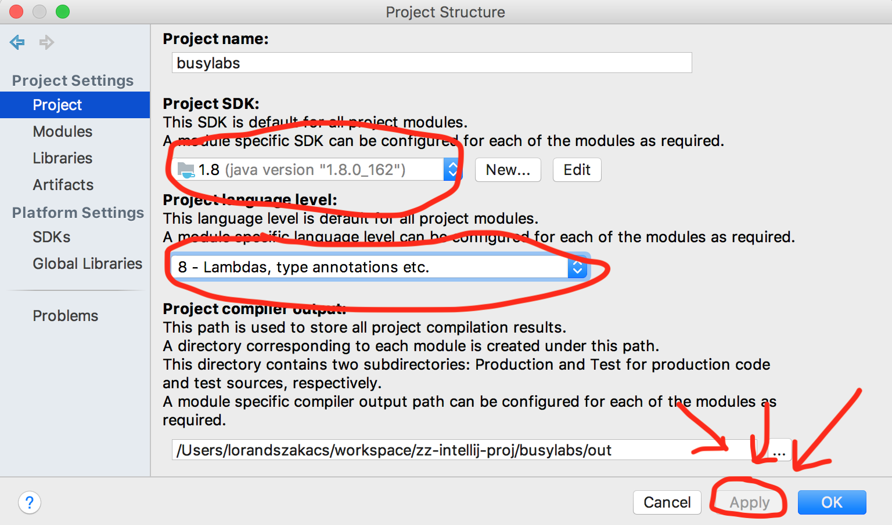

### 5 — Import SBT project — `Modules` tab

From the same window, choose the `Modules` tab on the right hand side.

Then go click on that `+` and select the `Import Module`. ALWAYS import, never create.

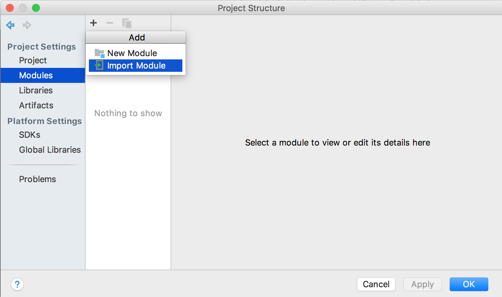

Navigate to the root folder of the git repo, and select it.

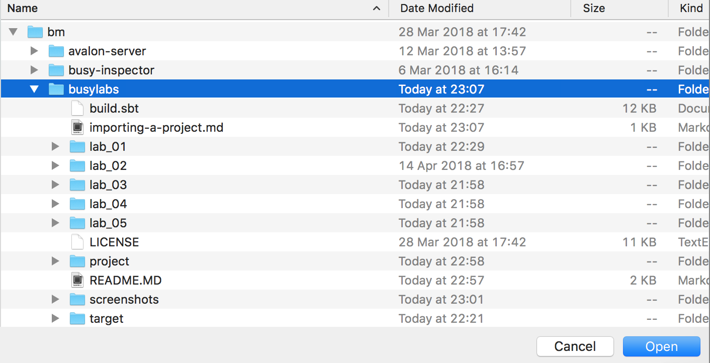

You will be immediately redirected to the following screen. Select sbt as you see here. If these options are greyed out to you it means that you did not actually select the root (the same folder which contains the `build.sbt` file) of the git repo, or you missed some of the earlier steps. Rollback, try again!

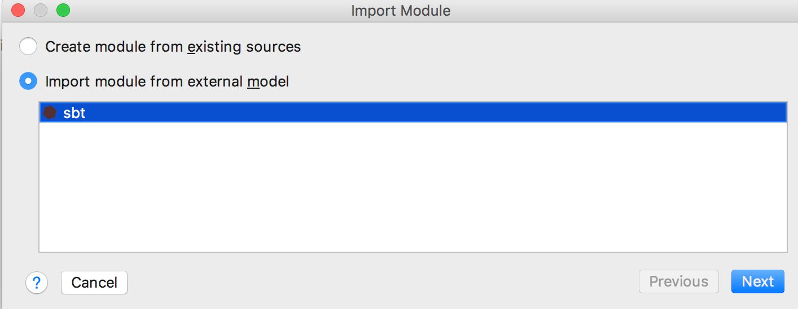

Now, you don't really need to change anything on this next screen, but it is recommended you give SBT a tad bit more memory. Not quite 4GB as seen here, but more than the default. Expand the `Global sbt settings tab`

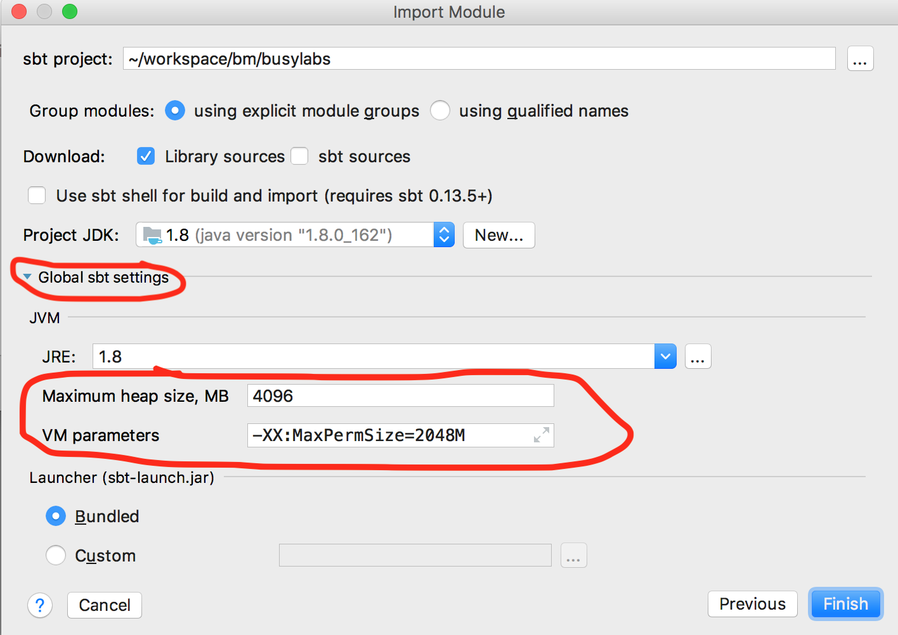

Just hit OK at this point. Nothing to change here.

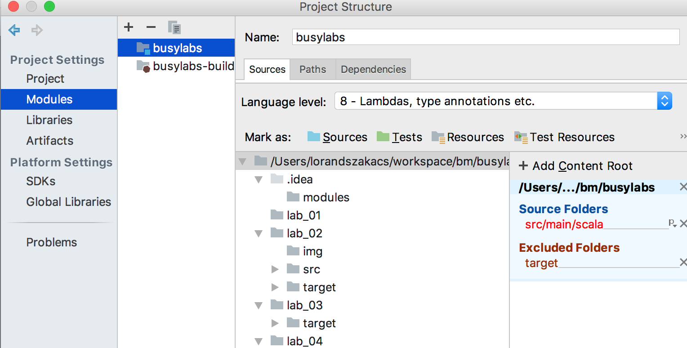

Wait for the import to actually finish, see progress bar (that either 0% or 100%) at bottom of screen:

### 6 — If something needs changing, go SBT

If you need to add a new module, or dependency then just modify your `build.sbt` accordingly. And then *refresh* your build, or start all over again, in IntelliJ. Remember the maxim at the top of this guide, SBT is the only source of truth. IntelliJ projects are ephemeral.

Open the sbt pane.

#### 6.1 — `View -> Tool Windows`

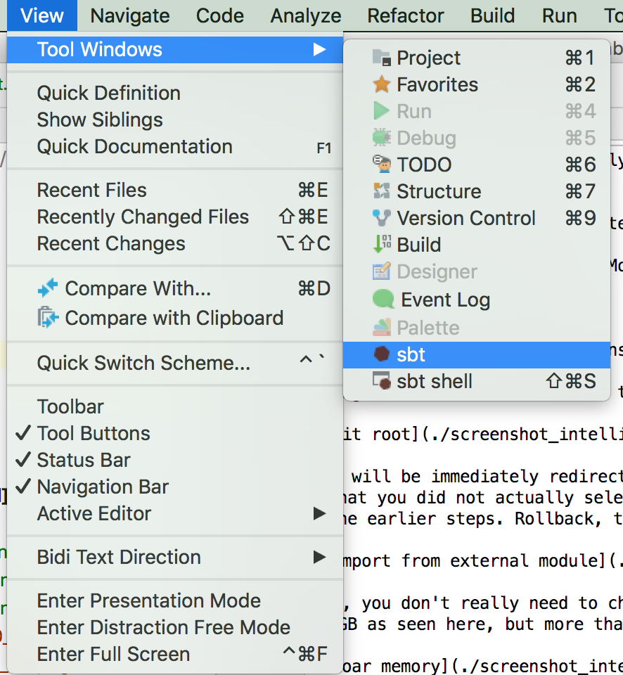

#### 6.2 — right hand side dock

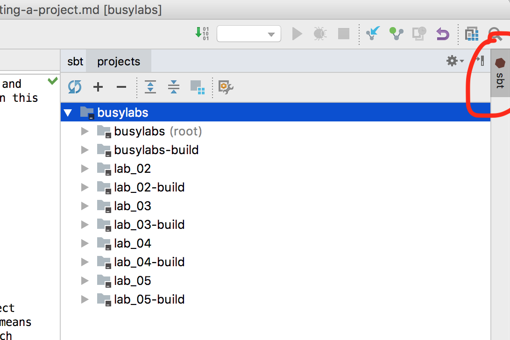

#### 6.3 — hit refresh button and wait

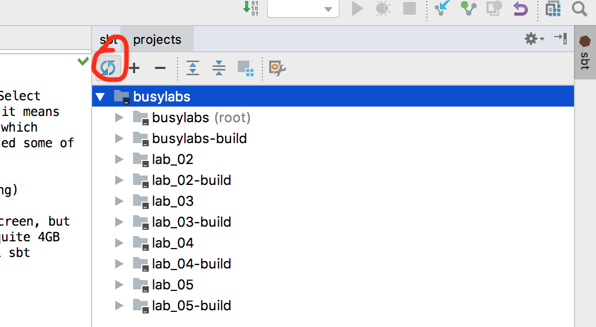

