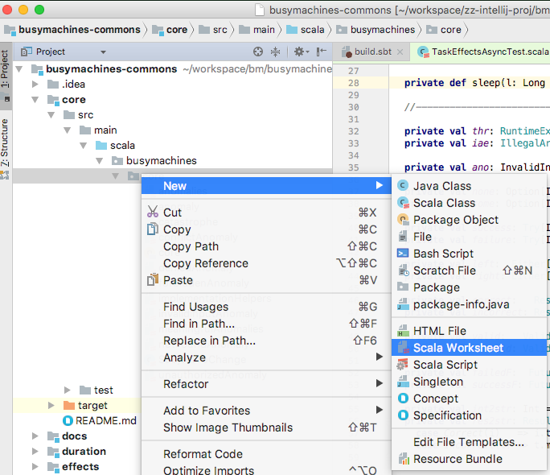

# Time to learn Scala

A more or less comprehensive list of everything you need to know can be found here (mostly put in linear order):
[http://busymachines.github.io/busymachines-commons/docs/learning.html](http://busymachines.github.io/busymachines-commons/docs/learning.html)

If you get the chance please skim over, and try writing some Scala code from, Dave Gurnell's [Essential Scala](https://underscore.io/training/courses/essential-scala/) by April 3rd's lab. The free download link can be found on the right hand side of the page, don't be intimidated by the absurdly expensive course.

N.B. the book says that you can use "Scala IDE" (which is Eclipse based), because of its "worksheet" feature, but IntelliJ also has that. e.g:

## Read code

You have not learned Scala until you actually read code. This is a skill that you will continuously develop during the entire lab, and hopefully afterwards as well. I put this section here for future reference mostly, but each of us have different writing styles and maybe a book is too boring.

There are infinitely more ways to write complete and utter shit Scala code, but few ways to write good code. Therefore try looking for the best examples. Some are inhouse:
1. [busymachines-commons](https://github.com/busymachines/busymachines-commons)
2. [avalon-server](https://bitbucket.org/busymerlin/avalon-server) — uses `busymachines-commons` extensively. But is slightly different in style than what we'll be doing. But it's still a good place to learn to read code. Hosted on bitbucket mostly because it was sort-of a side project. The server which is actually online @ [http://94.130.140.123:9012/avalon/graphiql.html](http://94.130.140.123:9012/avalon/graphiql.html). It's an implementation of the "Avalon" board game.

Others are open-source community projects:
1. Basically everything [typelevel](https://github.com/typelevel)

## Email and slack

Don't forget to ask questions by email or on slack [busy-labs-2018.slack.com](busy-labs-2018.slack.com)!
